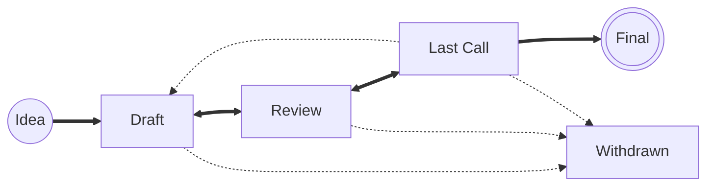

# IIPs
IIP stands for Instun Improvement Proposal. An IIP is a design document providing information to the Instun community, or describing a new feature for Instun or its processes or environment. The IIP should provide a concise technical specification of the feature and a rationale for the feature. The IIP author is responsible for building consensus within the community and documenting dissenting opinions.

## IIP status terms
The following is the standardization process for all IIPs in all tracks:

- **Idea** - An idea that is pre-draft. This is not tracked within the IIP Repository.
- **Draft** - The first formally tracked stage of an IIP in development. An IIP is merged by an IIP Editor into the IIP repository when properly formatted.
- **Review** - An IIP Author marks an IIP as ready for and requesting Peer Review.
- **Last Call** - This is the final review window for an IIP before moving to `Final`. An IIP editor will assign `Last Call` status and set a review end date (`last-call-deadline`), typically 14 days later.
- **Final** - This IIP represents the final standard. A Final IIP exists in a state of finality and should only be updated to correct errata and add non-normative clarifications.
- **Withdrawn** - The IIP Author(s) have withdrawn the proposed IIP. This state has finality and can no longer be resurrected using this IIP number. If the idea is pursued at later date it is considered a new proposal.
